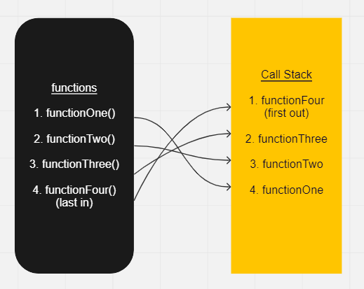

# Class 10

## In memory storage

### Understanding the JavaScript Call Stack

1. What is a ‘call’?

   - A function invocation!
   
2. How many ‘calls’ can happen at once?

   - One at a time.

3. What does LIFO mean?

   - Last In First Out

4. Draw an example of a call stack and the functions that would need to be invoked to enerate that call stack.

   - 

5. What causes a Stack Overflow?

   - When there is a recursive function without an exit point.

### JavaScript error messages

1. What is a ‘reference error’?

   - Basically a error involving a variable. If a variable is not declared or if there is a hoisting issue.

2. What is a ‘syntax error’?

   - This error occurs when there is an error invloving syntax. For instance, using an array method on a string will return a syntax error.

3. What is a ‘range error’?

   - When an element is given an invalid length. i.e. an array with a negative length.

4. What is a ‘type error’?

   - When an element you are trying to use is incompatible. i.e. trying to use dot notation to access a key/value on a string or something like that.

5. What is a breakpoint?

   - A breakpoint is the point in the code where it stops running.

6. What does the word ‘debugger’ do in your code?

   - It runs the code up until that breakpoint, at which it stops and you can debug your code.
